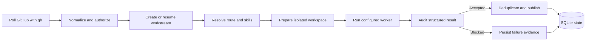

# Robert

[English](README_EN.md) | [简体中文](README.md)

**Your Repo Teammate**

An AI teammate that takes care of your GitHub work.

Robert is a self-hosted GitHub teammate that turns trusted issues, mentions,
assignments, reviews, and follow-up comments into controlled coding-agent work.
It coordinates local workers, isolates repository work in Git worktrees,
audits proposed GitHub actions, and stores durable workstream state in SQLite.

## What Robert Is

Robert is a local control plane for trusted GitHub collaboration. It discovers
authorized work, routes it to a configured worker, supervises execution, audits
the proposed GitHub actions, and publishes only actions allowed by the route.

## Why Robert Exists

Coding agents are useful, but unattended GitHub automation needs durable state,
clear trust boundaries, isolated workspaces, deduplication, and evidence.
Robert provides those controls without requiring a GitHub App or hosted service.

## Key Capabilities

- Trusted issue, pull-request, review, assignment, and mention handling.
- Multi-repository workstreams stored in SQLite.
- Per-route worker, required-skill, and recommended-skill configuration.
- Isolated Git worktrees for analysis, implementation, and source review.
- Native systemd user services and macOS LaunchAgents.
- Read-only local web UI with an explicitly enabled writable mode.
- Optional read-only OpenClaw chat commands.
- Safe migration from the former `dd-github-agent` state directory.

## How It Works



Robert polls GitHub through the authenticated `gh` CLI, normalizes events,
checks repository-specific trust rules, creates or resumes a workstream, selects
a route, prepares a task workspace, launches a local worker, audits its
structured result, and deduplicates approved GitHub actions before publication.

## Security and Trust

GitHub text is untrusted input. Only configured actors can trigger work.
Repository overrides cannot change immutable route permissions or workspace
policy. Worker environments use an allowlist, credentials are never stored in
Robert configuration, and GitHub-facing text passes the redaction and audit
gates. The web UI binds to `127.0.0.1` by default.

## Requirements

- Linux or macOS. Windows is supported through WSL.
- Python 3.10 or newer.
- Git and GitHub CLI (`gh`) with an authenticated session.
- At least one local worker command such as Codex.
- `pipx` is recommended for installation.

## Quick Start

```bash
pipx install robert-github-agent
gh auth login
robert init
robert doctor
robert service install
robert service start
```

The configuration is written to `~/.config/robert/config.yml`. Runtime data is
stored under `~/.local/share/robert/`.

## Install with a Coding Agent

Copy this prompt into Codex, Claude Code, or another terminal coding agent:

```text
Install and fully configure Robert on this machine by following:
https://github.com/wklken/Robert/blob/main/docs/agent-install.md

Read the entire guide before executing. Ask me for required values and for
confirmation wherever the guide requires it.
```

## Configuration

Robert uses versioned YAML. Configure the GitHub account, worker definitions,
skill search paths, route overrides, and one or more repository checkouts.
See [docs/reference.md](docs/reference.md#configuration).

## Worker Adapters

Built-in adapters support `codex`, `tcodex`, `cbc`, and a generic `command`
adapter. A worker definition chooses its adapter, executable, default model,
effort, timeout, prompt transport, and environment-variable allowlist.

## Route Skills

Each route can declare required and recommended skills. Missing required skills
block that task before a worktree or worker is created. Missing recommended
skills appear in doctor output but do not block execution.

## Multiple Repositories

Each repository has its own checkout, worktree root, trusted actors, concurrency
limit, and optional route overrides. A failure in one repository does not stop
other repository pipelines in the same cycle.

## Daemon Service

```bash
robert service install
robert service start
robert service status
```

Robert runs in the foreground under systemd user services or launchd. Use
`robert daemon run` for direct foreground operation.

## Local Web UI

```bash
robert web run
```

The default server is local and read-only. Writable mode requires:

```bash
robert web run --writable --operator "$USER"
```

Non-loopback binding also requires `--allow-remote` and an authenticated reverse
proxy.

## OpenClaw

```bash
robert openclaw install
robert openclaw status
```

The optional plugin exposes read-only Robert status, task, run, and artifact
commands. It never schedules or starts Robert.

## Migration

Preview and import legacy state:

```bash
robert migrate dd-github-agent --dry-run
robert migrate dd-github-agent
```

Migration creates a separate backup and preserves legacy deduplication markers.

## Troubleshooting

Run `robert doctor --output json`, check `robert service status`, and export a
redacted support archive with:

```bash
robert diagnostics export --output robert-diagnostics.zip
```

Do not attach private repository content or credentials to public issues.

## Contributing

Read [COMMUNITY.md](COMMUNITY.md), run the documented verification commands,
and sign commits with `git commit -s`. Robert uses the Developer Certificate
of Origin and does not require a CLA for the first beta.

## Project Status

Robert `0.1.0b1` is a public beta. Polling is the only GitHub event transport in
this release. Interfaces may evolve before the first stable release.

## License

Apache License 2.0. See `LICENSE`.
