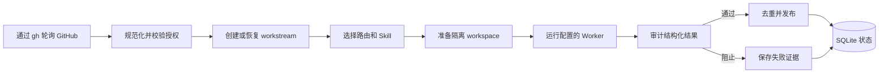

# Robert

[English](README.md) | [简体中文](README_ZH.md)

**Your Repo Teammate**

An AI teammate that takes care of your GitHub work.

Robert 是一个自托管的 GitHub 队友。它把可信的 Issue、提及、指派、评审和
后续评论转换为受控的编码代理任务，并通过 Git worktree、审计门禁和 SQLite
持久状态保证无人值守运行仍然可检查、可恢复。

## Robert 是什么

Robert 是运行在本机的 GitHub 协作控制面。它发现事件、校验信任关系、选择
路由和 Worker、监督执行、审计计划中的 GitHub 动作，并只发布路由允许的动作。

## 为什么需要 Robert

编码代理本身不能解决授权、并发、去重、失败恢复和证据留存。Robert 将这些
约束做成稳定协议，不需要 GitHub App，也不需要托管控制服务。

## 核心能力

- 处理可信的 Issue、PR、评审、指派和提及。
- 使用 SQLite 管理多仓库工作流。
- 按路由配置 Worker、必需 Skill 和推荐 Skill。
- 使用隔离的 Git worktree 进行分析、实现和源码评审。
- 支持 systemd 用户服务和 macOS LaunchAgent。
- 默认只读的本地 Web UI。
- 可选的 OpenClaw 只读聊天命令。
- 安全迁移原 `dd-github-agent` 目录中的配置和数据库。

## 工作流程



Robert 使用已认证的 `gh` CLI 轮询 GitHub，规范化事件，应用仓库级信任规则，
创建或恢复 workstream，准备任务目录，启动本地 Worker，审计结构化结果，并
在发布前执行去重。

## 安全与信任模型

GitHub 文本始终按不可信输入处理。只有配置中的可信 Actor 能触发工作。仓库
覆盖不能改变路由的 GitHub 权限和 workspace 策略。Worker 环境变量采用白名单，
配置文件不保存 GitHub Token，所有对外文本都经过脱敏和审计。Web UI 默认绑定
`127.0.0.1`。

## 环境要求

- Linux 或 macOS；Windows 通过 WSL 使用。
- Python 3.10 或更高版本。
- Git 和已登录的 GitHub CLI。
- 至少一个本地 Worker 命令。
- 推荐使用 `pipx` 安装。

## 快速开始

```bash
pipx install robert-github-agent
gh auth login
robert init
robert doctor
robert service install
robert service start
```

配置路径为 `~/.config/robert/config.yml`，运行数据默认位于
`~/.local/share/robert/`。

## 使用编码 Agent 安装

把下面的提示词复制给 Codex、Claude Code 或其他终端编码 Agent：

```text
Install and fully configure Robert on this machine by following:
https://github.com/wklken/Robert/blob/main/docs/agent-install.md

Read the entire guide before executing. Ask me for required values and for
confirmation wherever the guide requires it.
```

## 配置

Robert 使用带版本号的 YAML。配置包括 GitHub 账号、Worker、Skill 搜索路径、
路由覆盖和一个或多个本地仓库。详见
[docs/reference.md](docs/reference.md#configuration)。

## Worker 适配器

内置 `codex`、`tcodex`、`cbc` 和通用 `command` 适配器。Worker 定义包含命令、
默认模型、推理强度、超时、输入方式和环境变量白名单。

## 路由技能配置

路由可以配置必需 Skill 和推荐 Skill。缺少必需 Skill 时，任务会在创建
worktree 和启动 Worker 之前被阻止；缺少推荐 Skill 只会产生诊断提示。

## 多仓库

每个仓库拥有独立 checkout、worktree 根目录、可信 Actor、并发限制和路由覆盖。
单个仓库失败不会阻塞同一轮中的其他仓库。

## 守护进程

```bash
robert service install
robert service start
robert service status
```

无人值守运行使用 systemd 用户服务或 launchd。前台调试使用
`robert daemon run`。

## 本地 Web UI

```bash
robert web run
```

默认模式只读且仅监听本机。写入模式必须显式开启：

```bash
robert web run --writable --operator "$USER"
```

非回环地址还必须使用 `--allow-remote`，并部署经过认证的反向代理。

## OpenClaw 集成

```bash
robert openclaw install
robert openclaw status
```

插件只提供 Robert 状态、任务、运行和产物查询，不会启动 Robert，也不会创建
定时任务。

## 迁移

```bash
robert migrate dd-github-agent --dry-run
robert migrate dd-github-agent
```

迁移会保留独立备份，并继续识别旧的去重标记。

## 故障排查

先运行 `robert doctor --output json` 和 `robert service status`。需要提供诊断
信息时，生成经过脱敏的压缩包：

```bash
robert diagnostics export --output robert-diagnostics.zip
```

不要在公开 Issue 中上传凭证或私有仓库内容。

## 参与贡献

阅读 [COMMUNITY.md](COMMUNITY.md)，执行其中的验证命令，并使用
`git commit -s` 签署提交。首个 Beta 使用 DCO，不要求 CLA。

## 项目状态

Robert `0.1.0b1` 是公开 Beta。当前只使用轮询获取 GitHub 事件，稳定版之前接口
仍可能调整。

## 许可证

Apache License 2.0，详见 `LICENSE`。
