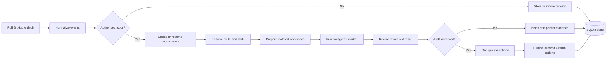

# Robert Concepts

## Architecture

Robert is a local Python control plane with five boundaries:

1. discovery and authorization through the authenticated `gh` CLI;
2. routing and immutable workspace policy;
3. worker dispatch inside repository-specific Git worktrees;
4. result audit, redaction, and publication deduplication;
5. durable SQLite state under `~/.local/share/robert/`.

The installed `robert` command reads `~/.config/robert/config.yml`.
`run_once.py` orchestrates bounded cycles, `daemon.py` schedules them,
`storage.py` owns schema setup, and route, worktree, dispatch, audit, and
publish modules enforce separate policies.

Robert uses polling in the first beta. It does not include a webhook receiver
or GitHub App authentication.

## Workflow



A cycle validates configuration, acquires repository leases, supervises active
attempts, processes events, prepares tasks, dispatches workers, audits results,
publishes allowed actions, and records a summary.

## Trust Model

GitHub content is untrusted even when syntactically valid. Robert creates work
only for configured repositories and authorized actors.

Each repository defines `trusted_actors`. Events from other users may be
retained as context, but they cannot independently start protected work. The
authenticated `gh` CLI session is the only GitHub credential source; tokens
must not be stored in configuration.

Workers cannot publish directly. They record structured planned actions.
Robert checks route permissions, verification evidence, skill evidence,
idempotency markers, and redaction before publication.

The web UI is read-only on `127.0.0.1` by default. Writable mode requires an
operator identity and CSRF token. Remote binding requires explicit
acknowledgement and an authenticated reverse proxy.

## Workstreams

A workstream is the durable collaboration thread for one GitHub issue, pull
request, or local work item. It links sources, events, tasks, attempts,
artifacts, worker results, and publication actions.

Issue and pull-request mainlines remain separate. A Robert-created pull request
records its origin issue, while review follow-up stays on the pull-request
workstream and reuses its branch.

Only one active task owns a workstream at a time. Additional authorized events
become pending context. Waiting-for-user tasks resume only after an authorized
reply.

```bash
robert status --config ~/.config/robert/config.yml
robert task show TASK_ID --config ~/.config/robert/config.yml --output json
```

## Routes

Routes define expected worker output, allowed GitHub actions, verification
policy, workspace mode, worker selection, and skill guidance.

Packaged routes include analysis, new pull request, existing pull-request
update, source review, review comment, classification, local result, and
waiting-for-user flows.

Immutable fields such as `allowed_github_actions`, `expected_output`,
`verification_policy`, and `workspace_mode` cannot be changed in
`~/.config/robert/config.yml`. Global and repository overrides may set only:

```yaml
routes:
  new-pr:
    worker: default
    required_skills: []
    recommended_skills:
      - fast-add-tests
```

Repository overrides replace only the fields they explicitly provide.

## Worker Contract

Robert sends a task prompt to a configured local worker through standard input.
The prompt names the task, attempt, workstream, route, allowed GitHub actions,
workspace, verification policy, skill guidance, and registered context files.

The worker records a structured result with:

- task and attempt identifiers;
- expected output type;
- planned GitHub actions;
- consumed event fingerprints;
- skills actually used;
- verification evidence;
- optional memory and review-point evaluation.

Workers must not publish GitHub changes directly. Robert audits and publishes
accepted actions. The environment contains only standard variables plus names
listed in the worker's `environment_allowlist`.

Worker state and artifacts live under `~/.local/share/robert/`; configuration
lives at `~/.config/robert/config.yml`.
