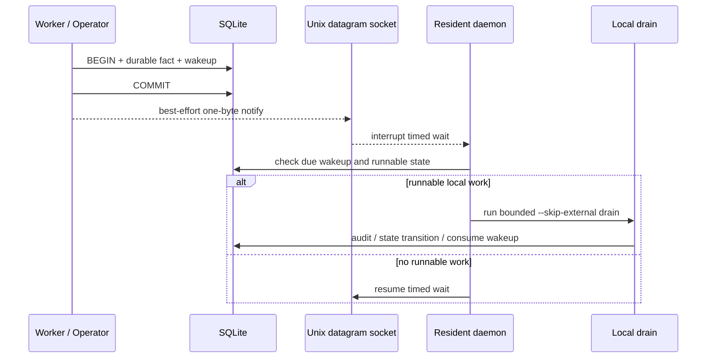

# Robert 内部事件驱动 Drain 设计

## 摘要

Robert 通过 GitHub polling 发现外部事实，并将 Task、Attempt、Worker result、
planned action 和 wakeup 持久化到 SQLite。外部事件已经可以在一次 live poll 后进入
local drain，但独立 Worker 或操作员在 daemon 休眠期间写入新事实时，仍需等待下一次
`local_poll_seconds` 才会继续 audit、publish 或 dispatch。

本设计将两类循环明确分开：

- **外部发现**：有频率、配额与退避控制地读取 GitHub 新事实。
- **内部推进**：只从已经持久化的本地事实出发，有界地推进状态机直到暂时稳定。

第一阶段使用 Unix domain datagram socket 作为 best-effort 门铃。SQLite 中的业务事实
和 pending wakeup 仍是唯一可靠的恢复来源；socket 消息不携带业务数据，不参与业务
幂等，也不能直接触发 publish。

## 第一阶段范围

本阶段实现：

1. 一个 SQLite 数据库只允许一个 resident daemon 持有 database-level daemon lease。
2. daemon 持有 lease 后绑定本地 Unix datagram socket。
3. Worker result 和创建后继 Task 的操作员命令在事务提交后发送 best-effort 通知。
4. daemon 收到通知后立即重新检查 SQLite，并进入现有 `run_once_decision` / local drain。
5. 通知丢失、socket 不可用或 daemon 重启时，现有低频数据库扫描继续恢复 pending work。

以下内容不属于本阶段：

- 多主机或多个 active control plane 实例。
- wakeup `claimed` 状态和独立的 queue-consumer lease。
- 跨仓库公平调度；当前 repo 顺序和共享 dispatch budget 的改造需要独立设计与 PR。
- 用 GitHub App、Webhook 或外部队列替代 GitHub polling。
- 将内部状态机改为同步递归调用。

## 已确认的现状

当前代码已经具备以下正确性基础：

1. live poll 完成后会调用 local drain。
2. local drain 通过 `loop_engine.py --skip-external` 重复执行本地 `run_once`。
3. Worker 在同一个 SQLite 事务中写入 result、planned action、Attempt 完成状态和
   `worker_result_ready` wakeup。
4. `run_once` 根据持久化的 Worker result、Attempt、Task 和 action 状态进行 audit、
   publish 与 finalize，而不是信任 wakeup payload。
5. Worker result 完成 audit 后，相关 wakeup 才被标记为 `consumed`。
6. 发布仍经过现有 audit、redaction、action-scope revalidation 和 marker-based
   deduplication 边界。

缺失的是跨进程低延迟通知：resident daemon 当前使用 `time.sleep` 等待下一次本地
检查，独立 Worker 完成后不能主动缩短这段等待。

## 正确性原则

### SQLite 先于通知

每个能够推进状态机的 producer 必须先提交业务事实及对应 wakeup，再发送通知：

```text
BEGIN
  write durable fact
  write or reuse deduplicated wakeup
COMMIT
best_effort_notify()
```

不得在事务提交前通知。否则 daemon 可能先醒来、读不到未提交事实并重新休眠，使这次
通知失去降低延迟的作用。

通知失败不得回滚或否定已经提交的业务事务。producer 可以忽略 `unavailable` 结果，
pending wakeup 会在后续低频扫描中被处理。

### 通知只是门铃

Unix socket datagram 固定发送一个无业务含义的字节。消息不包含 repo、Task、Attempt、
result ID 或 action。daemon 收到消息后只执行以下动作：

1. 清空当前已排队的 datagram，将重复通知合并为一次检查。
2. 调用与启动恢复、低频扫描相同的 SQLite runnable-work 检查。
3. 如有工作，进入同一条 local drain；如无工作，继续等待。

不存在 signal-only 快捷路径，Worker、Web UI 和 CLI 都不能通过 socket 直接调用 audit、
publish 或修改受保护的 Task 生命周期。

### 单一推进者

第一阶段明确采用“一份 SQLite 数据库一个 resident daemon”。daemon lease 的
`resource_key` 使用 canonical database path，而不是配置中的 repo 集合，因此两个
指向同一数据库但包含不同 repo 集合的配置不能同时成为 active daemon。

daemon lease 负责数据库级 resident ownership；现有 repo agent lease 继续保护单个
repo pipeline。Worker 只写 result 等事实；授权的操作员命令处理器是控制面写边界，
可以按现有规则更新生命周期，但不能直接 publish。resident daemon 仍是 audit、dispatch
和 publish 的唯一推进者。

### Wakeup 不增加 claim 状态

现有 wakeup 是 durable hint，不是携带完整业务 payload 的工作队列。`run_once` 会从
Worker result、Attempt、Task 和 action 的当前状态重新判断是否需要推进，并在 audit
事务中标记对应 wakeup consumed。

因此第一阶段不在 drain 前把 wakeup 改成 `claimed`。提前 claim 会引入“已 claim、业务
尚未推进时崩溃”的额外恢复状态，却不会比现有 database daemon lease 与业务状态校验
提供更强保证。

如果未来允许多个 daemon 并发消费同一数据库，再为 wakeup 引入 claim owner、claim
lease、过期恢复与有限重试；该协议必须与业务状态提交保持一致，不能只表示“看见过”。

### 至少一次唤醒与幂等效果

内部通知采用 at-least-once 思维：通知可以重复、合并或丢失，daemon 也可以在任意步骤
崩溃。正确性来自重新读取 durable state 和幂等状态迁移。

不得把 GitHub 外部效果描述为事务级 exactly-once。SQLite 无法与 GitHub API 组成同一
事务；Robert 通过 action 状态、隐藏 marker、远端回读和 publish deduplication 实现
effectively-once 效果。崩溃恢复测试应断言不会产生重复可见动作，而不是宣称分布式
事务意义上的“恰好一次”。

## Unix socket 契约

### 地址与权限

socket 默认位于：

```text
<database parent>/run/wakeup-<canonical database path hash>.sock
```

- `run` 目录权限为 `0700`。
- socket 权限为 `0600`。
- 同一目录中的不同数据库使用不同 hash，因此可以各自持有一个 listener。
- daemon 只有在成功持有 database-level lease 后才创建或清理 socket。
- 启动时可以删除同一路径的 stale socket，但不能覆盖普通文件。
- 退出时只删除当前 listener 创建的同一设备与 inode，不能误删后来替换的 socket。

若自定义 data directory 导致 Unix socket 路径过长、平台不支持 AF_UNIX、权限不足或
bind 失败，daemon 记录 `wakeup_listener_unavailable`，继续使用现有 polling。该降级
不能阻止 daemon 启动。

### 等待与合并

daemon 每轮仍先执行 `run_once_decision`。需要休眠时，等待时间为现有 scheduler 计算
的较近 deadline：local poll interval 或下一次 live poll deadline。

- listener 可用：对 socket 做带 timeout 的等待。
- 收到一个或多个 datagram：清空队列并立即开始下一轮 SQLite 检查。
- timeout：执行原有低频检查。
- local drain 仍在运行时收到通知：datagram 留在 socket buffer；当前 drain 返回后，
  下一轮检查或等待会消费它，不递归启动第二个 drain。

## 时序



## Producer 行为

### Worker result

Worker result recorder 在一个事务中保存：

- `worker_results`；
- planned `github_actions`；
- Attempt 的 completed 状态；
- `worker_result_ready` wakeup。

事务成功退出后才调用 notifier。若 supervisor 已拒绝迟到 result，事务回滚且不通知。

### 操作员命令

创建或恢复后继 Task 的操作员命令会同时创建 `manual_operator_request` wakeup，并在
提交后通知 daemon。只创建 Backlog、编辑纯展示字段或没有产生可运行 Task 的命令不
发送空通知。

GitHub 事件在 active daemon 的 live poll/run_once 内产生时，当前执行链本身已经会
进入 local drain，不需要额外跨进程门铃。

## 外部 API 边界

`--skip-external` 表示 internal drain 不重新执行 GitHub notification discovery。
它不等于完全禁止所有 GitHub API：已通过 audit 的 publish action、明确的远端状态
校验和 rate-limit guard 仍可能使用各自受控的 API。

事件驱动通知不能增加 notification discovery 次数。它可以让已经允许的 publish 更早
发生，但 action idempotency 与预算仍由现有 publisher 和 loop engine 控制。

## 失败处理

| 场景 | 正确行为 |
| --- | --- |
| 重复通知 | 合并 datagram，重新检查 durable state，无重复业务效果 |
| 通知丢失 | 下次 local poll 发现 pending wakeup |
| daemon 不运行 | producer 得到 best-effort `unavailable`，已提交事实不受影响 |
| socket bind 失败 | 记录 degraded event，daemon 继续 polling |
| daemon 崩溃 | lease 到期后新 daemon 清理 stale socket，并从 SQLite 恢复 |
| result 写入后、notify 前崩溃 | pending wakeup 由启动或低频扫描恢复 |
| notify 后、audit 前崩溃 | 新 daemon 根据未审计 result 重新推进 |
| 迟到或被取消的 result | supervisor 状态校验拒绝，不创建 result/wakeup，不通知 |
| GitHub publish 响应后、本地记录前崩溃 | marker 与远端回读执行 effectively-once 去重 |

## 第一阶段验收标准

1. Worker result、planned action、Attempt 状态和 wakeup 对其他连接可见后才发送通知。
2. listener 可用时，通知可以中断 daemon 的 local-poll timed wait。
3. 多个快速通知只触发一次新的 SQLite 检查，不递归启动 drain。
4. listener 不可用时，producer 仍成功，daemon 仍能通过低频扫描处理 pending work。
5. 指向同一 SQLite 数据库的第二个 daemon 配置不能获得 active daemon lease。
6. daemon 重启可以安全替换 stale socket，正常退出不会删除其他进程替换的 socket。
7. 通知不能绕过 audit、action-scope、redaction、publish deduplication 或 repo lease。
8. 单元与集成测试同时断言 socket 行为、SQLite 提交顺序、daemon fallback 和重复通知。

## 后续工作

跨仓库公平性仍是独立问题：当前 `run_once` 按配置顺序遍历 repo，并共享全局 dispatch
budget，前面的高活跃 repo 可能长期消耗预算。后续 PR 应选择并持久化公平调度规则，
例如带 aging 的全局 runnable queue 或持久 round-robin cursor，并分别验证全局、repo
和 workstream 预算。

只有在未来支持多个 active daemon 共同消费同一数据库时，才引入 wakeup claim lease。
届时还需要定义 claim 过期、崩溃恢复、retry budget 以及与业务状态提交的原子关系。
